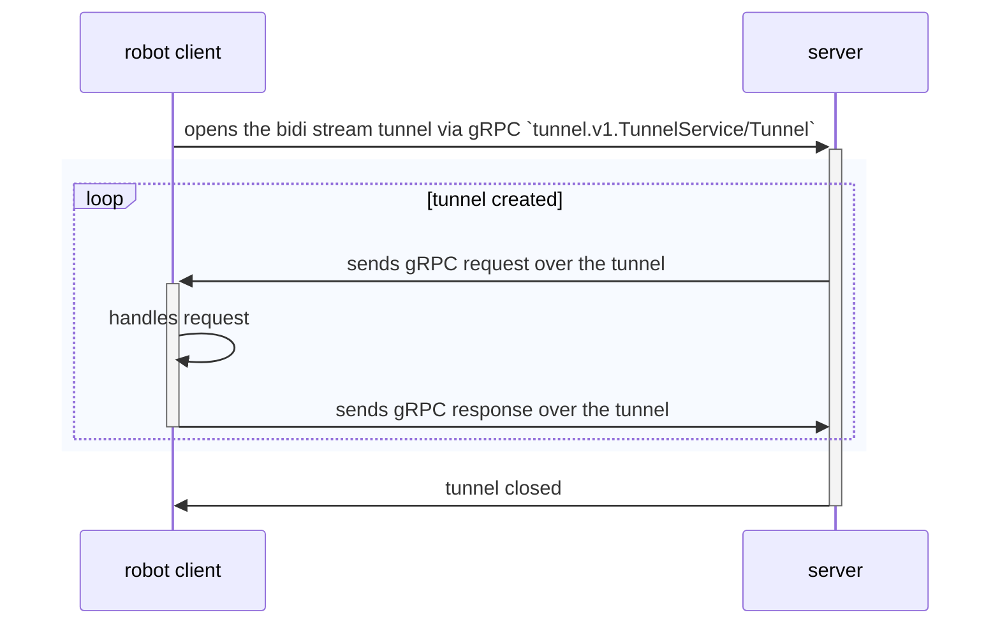

# GRPC Tunnel

## Overview

```mermaid
sequenceDiagram
    participant robot client
    participant server
    robot client->>+server: opens the bidi stream tunnel via gRPC `tunnel.v1.TunnelService/Tunnel`
    rect rgb(247, 250, 255)
      loop tunnel created
        server->>+robot client: sends gRPC request over the tunnel
        robot client->>robot client: handles request
        robot client->>-server: sends gRPC response over the tunnel
      end
    end
    server->>-robot client: tunnel closed
```

## Notes
- Robot client should be written in Python
- Server should be written in Go
- The tunnel should be bidirectional